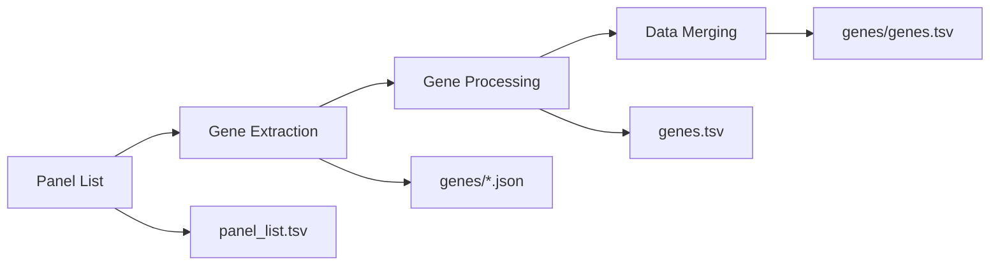

# PanelApp Australia Database Extractor

A comprehensive toolkit for automatically extracting and processing data from the [PanelApp Australia API](https://panelapp-aus.org/api/docs/). This project provides both wrapper scripts for complete automation and individual scripts for fine-grained control.

## 🚀 Quick Start

### Complete Data Extraction (Recommended)

Use the main wrapper scripts for full automation:

**Windows PowerShell:**
```powershell
# Complete extraction workflow
.\create_PanelAppAusDB.ps1

# Skip gene extraction (panel list only)
.\create_PanelAppAusDB.ps1 -SkipGenes

# Force re-download all data
.\create_PanelAppAusDB.ps1 -Force -Verbose
```

**Linux/macOS/WSL:**
```bash
# Complete extraction workflow
./create_PanelAppAusDB.sh

# With custom output path
./create_PanelAppAusDB.sh --output-path "data"
```

## 🎯 Key Features

- **🔄 Complete Automation**: Single-command workflow from API to analysis-ready data
- **📊 Cross-Panel Analysis**: Consolidated datasets with panel_id columns for multi-panel research
- **🔍 Incremental Processing**: Smart version tracking to avoid unnecessary re-downloads
- **✅ Built-in Validation**: Automatic data integrity checks and error reporting
- **🖥️ Cross-Platform**: Both PowerShell (Windows) and Bash (Linux/macOS/WSL) versions
- **📈 Comprehensive Logging**: Detailed progress tracking and colored output

## 🛠️ What Gets Extracted

| Data Type | Status | Description |
|-----------|---------|-------------|
| **Panel Metadata** | ✅ Ready | Panel information, versions, gene counts |
| **Gene Data** | ✅ Ready | Detailed gene information with confidence levels |
| **Panel Merging** | ✅ Ready | Consolidated cross-panel datasets |
| **STR Data** | ⏳ Planned | Short Tandem Repeat information |
| **Region Data** | ⏳ Planned | Genomic region definitions |

## 💻 System Requirements

### Windows (PowerShell)
- PowerShell 5.1 or later
- Internet access

### Linux/macOS/WSL (Bash)
- `bash` shell
- `curl` command  
- `jq` JSON processor
- Internet access

## 📦 Installation

```bash
git clone https://github.com/ChrisRem85/PanelAppAusDB.git
cd PanelAppAusDB
```

**Dependencies:**
- **Windows**: No additional setup required
- **Linux/macOS**: Install `jq` if not available (`sudo apt-get install jq` or `brew install jq`)

## 📖 Usage Guide

### Main Wrapper Scripts

The `create_PanelAppAusDB` scripts provide complete automation for the entire data extraction workflow:

**Windows PowerShell:**
```powershell
# Set execution policy if needed
Set-ExecutionPolicy -ExecutionPolicy Bypass -Scope Process

# Complete workflow (recommended)
.\create_PanelAppAusDB.ps1

# Panel list extraction only
.\create_PanelAppAusDB.ps1 -SkipGenes

# Force complete re-download
.\create_PanelAppAusDB.ps1 -Force -Verbose

# Specific panel with custom output path
.\create_PanelAppAusDB.ps1 -PanelId 6 -OutputPath "data" -Verbose
```

**Linux/macOS/WSL:**
```bash
# Make executable (first time only)
chmod +x create_PanelAppAusDB.sh

# Complete workflow (recommended)  
./create_PanelAppAusDB.sh

# Custom output directory
./create_PanelAppAusDB.sh --output-path "custom_data"
```

### Wrapper Script Parameters

| Parameter | PowerShell | Bash | Description |
|-----------|------------|------|-------------|
| Output Path | `-OutputPath` | `--output-path` | Custom data directory |
| Skip Genes | `-SkipGenes` | N/A | Extract panel list only |
| Panel ID | `-PanelId` | N/A | Process specific panel only |
| Force | `-Force` | N/A | Force complete re-download |
| Verbose | `-Verbose` | N/A | Detailed logging |

### Individual Script Documentation

For advanced usage or specific requirements, detailed documentation is available for each component:

#### 📋 Core Processing Steps

1. **[Panel List Extraction](docs/extract_panel_list.md)**
   - Extract comprehensive panel metadata from PanelApp Australia API
   - Creates `panel_list.tsv` with panel information and statistics

2. **[Gene Data Extraction](docs/extract_genes.md)**  
   - Download detailed gene data for each panel with incremental updates
   - Version tracking and intelligent change detection

3. **[Gene Data Processing](docs/process_genes.md)**
   - Convert raw JSON data to structured TSV format
   - Built-in validation and automatic missing file detection

4. **[Panel Data Merging](docs/merge_panels.md)**
   - Consolidate individual panel data into cross-panel datasets
   - Enables multi-panel analysis with panel_id traceability

#### 📚 Complete Documentation Index

### Detailed Script Documentation

This section provides comprehensive information about all individual scripts for advanced users and specific use cases.

#### Core Extraction Scripts

1. **[Panel List Extraction](docs/extract_panel_list.md)**
   - Extract panel metadata from PanelApp Australia API
   - Creates `panel_list.tsv` with comprehensive panel information
   - Available in PowerShell and Bash versions

2. **[Gene Data Extraction](docs/extract_genes.md)**
   - Download detailed gene data for each panel
   - Incremental extraction with version tracking
   - Available in PowerShell and Bash versions

3. **[Gene Data Processing](docs/process_genes.md)**
   - Convert JSON gene data to structured TSV format
   - Built-in validation and missing file detection
   - Available in PowerShell and Bash versions

4. **[Panel Data Merging](docs/merge_panels.md)**
   - Consolidate individual panel data into cross-panel datasets
   - Adds panel_id columns for traceability
   - Available in PowerShell and Bash versions

#### Script Comparison Matrix

| Feature | Panel List | Gene Extraction | Gene Processing | Panel Merging |
|---------|------------|----------------|----------------|---------------|
| **Input** | PanelApp API | Panel List + API | JSON files | Individual TSV files |
| **Output** | panel_list.tsv | genes/*.json | genes.tsv | genes/genes.tsv |
| **Version Tracking** | ❌ | ✅ | ✅ | ✅ |
| **Incremental Updates** | ❌ | ✅ | ✅ | ✅ |
| **Cross-platform** | ✅ | ✅ | ✅ | ✅ |
| **Validation** | ❌ | ❌ | ✅ | ❌ |

#### Platform Support

All scripts are available in two versions:

- **PowerShell (.ps1)**: Windows PowerShell 5.1+
- **Bash (.sh)**: Linux/macOS/WSL with standard Unix tools

#### Getting Started Guide

- **Most users**: Use the main wrapper scripts (`create_PanelAppAusDB.*`) for complete automation
- **Advanced users**: Use individual scripts for specific requirements and fine-grained control
- **Developers**: Refer to individual script documentation for detailed parameters and usage

### Workflow Overview

The complete extraction process follows this sequence:



**Automated by `create_PanelAppAusDB` scripts** or run individually using the scripts in the `scripts/` directory.

## 📁 Output Structure

The extraction process creates a well-organized directory structure:

```
data/
├── panel_list/
│   └── panel_list.tsv                # ← Summary of all panels
├── genes/  
│   └── genes.tsv                     # ← Consolidated cross-panel gene data
└── panels/[panel_id]/
    └── genes/
        ├── json/                     # Raw API data
        └── genes.tsv                 # Individual panel gene data
```

### Key Output Files

| File | Description |
|------|-------------|
| **`panel_list.tsv`** | Complete panel metadata and statistics |
| **`genes/genes.tsv`** | **Cross-panel consolidated gene dataset** |
| **`panels/*/genes.tsv`** | Individual panel gene data |

> **💡 Pro Tip**: The consolidated `genes/genes.tsv` file includes a `panel_id` column, making it perfect for cross-panel analysis and research.

## 🔍 Data Overview

### Panel Information
Each panel includes comprehensive metadata: ID, name, version, creation date, and entity counts (genes, STRs, regions).

### Gene Data Structure  
Detailed gene information with confidence levels, inheritance patterns, phenotypes, and external database references (HGNC, OMIM, etc.).

**📖 [View detailed data specifications →](docs/README.md)**

## ⚙️ Configuration

All configuration is embedded within the scripts for simplicity. Default settings work for most users:

- **API Endpoint**: `https://panelapp-aus.org/api/v1`
- **Output Directory**: `data/` (relative to script location)
- **Safety Limits**: 10,000 pages maximum to prevent infinite loops

To modify settings, edit the configuration variables at the top of each script file.

## 📚 Documentation Navigation

### Quick Links
- **[📖 Complete Documentation](docs/README.md)** - Comprehensive guide to all scripts
- **[📋 Panel List Scripts](docs/extract_panel_list.md)** - Extract panel metadata  
- **[🧬 Gene Extraction Scripts](docs/extract_genes.md)** - Download gene data
- **[⚡ Gene Processing Scripts](docs/process_genes.md)** - Convert JSON to TSV
- **[🔀 Panel Merging Scripts](docs/merge_panels.md)** - Create consolidated datasets

### External Resources
- **[PanelApp Australia API](https://panelapp-aus.org/api/docs/)** - Official API documentation
- **[OpenAPI/Swagger Docs](https://panelapp-aus.org/api/docs/?format=openapi)** - Interactive API explorer

## 🔧 Technical Details

### API Information
- **Endpoint**: `https://panelapp-aus.org/api/v1`
- **Current Status**: ~283 panels available (October 2025)
- **Pagination**: ~100 panels per page, 3 total pages

### Error Handling
All scripts include comprehensive error handling for HTTP requests, JSON parsing, file system operations, and API version compatibility.

### Output Format
All TSV files use tab-separated values with headers, compatible with Excel, R, Python pandas, and other analysis tools.

## 🤝 Contributing

1. Fork the repository
2. Create a feature branch (`git checkout -b feature/amazing-feature`)
3. Make your changes
4. Add tests if applicable  
5. Submit a pull request

## 📄 License

This project is open source. Please check the LICENSE file for details.

## 🆘 Support

- **Issues**: [GitHub Issues](https://github.com/ChrisRem85/PanelAppAusDB/issues)
- **API Problems**: [PanelApp Australia API Docs](https://panelapp-aus.org/api/docs/)
- **Documentation**: Check error logs and [detailed documentation](docs/README.md)

---

## 📋 Changelog

### Version 2.0.0 (Current)
- **NEW**: Complete workflow automation with `create_PanelAppAusDB` wrapper scripts
- **NEW**: Panel data merging for cross-panel analysis with `merge_panels` scripts
- **NEW**: Comprehensive documentation restructure with dedicated `docs/` folder
- **ENHANCED**: Incremental processing with intelligent version tracking
- **ENHANCED**: Built-in validation and error handling across all scripts

### Version 1.2.0  
- **BREAKING**: Separated gene extraction into dedicated scripts
- **NEW**: Individual processing scripts for genes (`extract_genes.*`, `process_genes.*`)
- **ENHANCED**: Command-line options and auto-detection features

### Version 1.1.0
- **NEW**: Panel statistics (gene, STR, region counts) in TSV output
- **ENHANCED**: Data extraction to include comprehensive panel metadata

### Version 1.0.0
- **INITIAL**: Core extraction scripts for Bash and PowerShell
- **FEATURES**: API version checking, pagination, TSV output generation